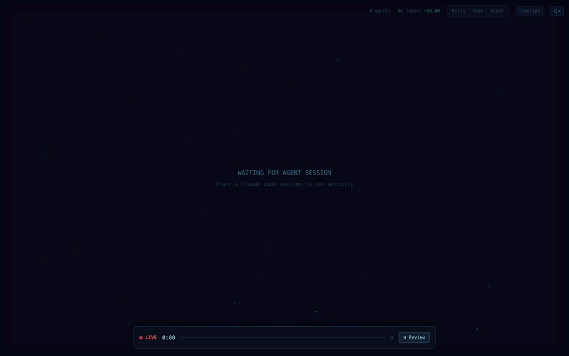
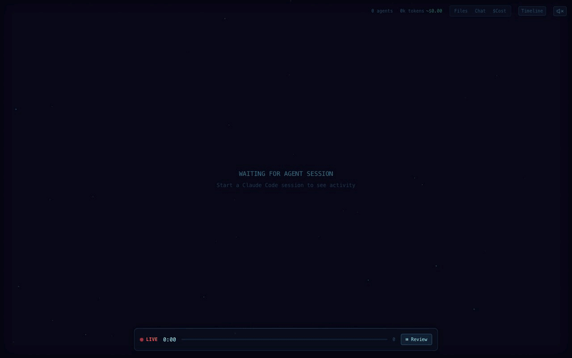

# Agent Flow

Real-time visualization of AI agent orchestration. Watch your agents think, branch, and coordinate as they work: Claude Code and Codex sessions out of the box, and agents built with **LangGraph**, **Strands Agents**, **Microsoft Agent Framework**, **CrewAI**, the **OpenAI Agents SDK** and **Google ADK** through framework adapters. [Demo video here](https://www.youtube.com/watch?v=Ud6eDrFN-TA).


## Why Agent Flow?

I built Agent Flow while developing [CraftMyGame](https://craftmygame.com), a game creation platform driven by AI agents. Debugging agent behavior was painful, so we made it visual. Now we're sharing it.

Agent runs are a black box. You see the final result, not the journey. Agent Flow makes the invisible visible:

- **Understand agent behavior:** see how an agent breaks down a problem, which tools it reaches for, and how subagents coordinate.
- **Debug tool call chains:** when something goes wrong, trace the exact sequence of decisions and tool calls that led there.
- **See the real shape of a workflow:** routing, parallel branches, merges and loops drawn as the graph they are, with live execution state.
- **See where time is spent:** spot slow tool calls, unnecessary branching or redundant work at a glance.
- **Learn by watching:** build intuition for writing better prompts by watching how an agent interprets and carries them out.

## See it in action



*A LangGraph supervisor handing work to two agents: tool calls fan out from each agent, messages appear as bubbles, and the Timeline (`T`) and transcript (`C`) panels replay the run.*

## Features

- **Live agent visualization:** agent execution as an interactive node graph, with real-time tool calls, branching and return flows.
- **Claude Code and Codex:**
  - **Auto-detection:** sessions from both runtimes are detected at the same time and shown side by side. You can restrict to one with the `agentVisualizer.runtime` setting.
  - **Claude Code hooks:** a lightweight HTTP hook server receives events straight from Claude Code, with zero latency.
  - **Codex rollout tailing:** reads `~/.codex/sessions/**/rollout-*.jsonl` (respects `CODEX_HOME`) and shows tool calls, reasoning and authoritative token counts from Codex's own event stream.
- **Framework adapters:** Python packages that stream [LangGraph](adapters/langgraph/), [Strands Agents](adapters/strands/), [Microsoft Agent Framework](adapters/agent-framework/), [CrewAI](adapters/crewai/), the [OpenAI Agents SDK](adapters/openai-agents/) and [Google ADK](adapters/google-adk/) runs into Agent Flow, including nested subagents, agents used as tools, handoffs, parallel branches and delegation.
- **OpenTelemetry import:** an OTLP/HTTP endpoint (`/v1/traces`) and an OTLP file reader turn production traces from OpenTelemetry SDKs, Collectors and OpenInference instrumentations into the same live view, graphs included.
- **Graph panel:** draws a workflow's actual nodes and edges, including conditional routes, loops, parallel branches and merges. Nodes that are subgraphs open their own graph when you click them. Overlays color the nodes by time, tokens, cost or errors, for one run or across every run of the graph (how often each route is taken, median and p95 node times, error rates). Compare diffs two runs: new and missing routes, and what got slower or costlier.
- **Canvas signals:** a context gauge ring on every agent that turns amber and red near the limit and flashes when context is compacted; red ripples on failures; retry arcs with attempt badges; guardrail checks as shields that pass or trip.
- **Models and cost:** each agent's outer ring is tinted by its model, and the Models legend totals agents, tokens and estimated cost per model for the whole run. Hover a model to spotlight its agents.
- **Swimlane timeline with critical path:** one lane per agent with every tool call, parallel calls stacked, and the chain of work that set the run's duration highlighted.
- **Event logs everywhere:** the VS Code extension and the standalone app can both replay and follow any JSONL event log.
- **Multi-session support:** track several agent sessions at once, each in its own tab.
- **Interactive canvas:** pan, zoom, and click agents and tool calls to inspect details.
- **Timeline and transcript panels:** review the full execution timeline, the file attention heatmap and the message transcript.

## Getting Started

### Quick Start (no VS Code required)

```bash
npx agent-flow-app
```

This starts the visualizer in your browser. Start a Claude Code session in another terminal, and events stream in real time.

Options:
- `--port <number>`: change the server port (default: 3001)
- `--no-open`: don't open the browser automatically
- `--verbose`: show detailed event logs
- `--event-log <path>`: also show a JSONL event log, such as one written by a [framework adapter](#visualize-agents-built-with-other-frameworks). You can repeat it for several logs. This option needs a build from this repository (see [below](#viewing-an-adapters-log)).

### Standalone Web App (from source)

```bash
git clone https://github.com/patoles/agent-flow.git
cd agent-flow
pnpm i
pnpm run setup      # configure Claude Code hooks (one-time)
pnpm run dev        # start the web app + event relay
```

Open http://localhost:3000 and start a Claude Code session in another terminal. Events stream to the browser in real time.

### VS Code Extension

1. Install the extension
2. Open the Command Palette (`Cmd+Shift+P`) and run **Agent Flow: Open Agent Flow**
3. Start a Claude Code or Codex session in your workspace. Agent Flow detects it automatically.

Agent Flow configures Claude Code hooks the first time you open the panel. To reconfigure them by hand, run **Agent Flow: Configure Claude Code Hooks** from the Command Palette.

### Runtime selection

By default Agent Flow watches both Claude Code (`~/.claude/projects/`) and Codex (`~/.codex/sessions/`) in all three entry points: the VS Code extension, `pnpm run dev` and `npx agent-flow-app`. Sessions are shown side by side and tagged by runtime. If you only use one runtime, watching the other has no visible effect and needs no action.

To restrict to one runtime:

- **VS Code extension:** set `agentVisualizer.runtime` to `"auto"` / `"claude"` / `"codex"` in your settings
- **`pnpm run dev` and `npx agent-flow-app`:** set the `AGENT_FLOW_RUNTIME` environment variable to `claude` or `codex` (it defaults to watching both)

For non-default Codex installs, set the `CODEX_HOME` environment variable.

## Visualize agents built with other frameworks

Each adapter is a small Python package in [`adapters/`](adapters/). It uses the framework's own extension points to write Agent Flow's JSONL event format, and Agent Flow follows that file live. Every adapter comes with a demo that needs no API key.

| Framework | Package | Attach it | Covers |
|---|---|---|---|
| [LangGraph](adapters/langgraph/) | `adapters/langgraph` (Python 3.9+) | `graph.invoke(..., config={"callbacks": [AgentFlowCallbackHandler(path, graph=graph)]})` | Subgraphs as subagents, `Send` fan-out, conditional edges, loops and merges, sync and async |
| [Strands Agents](adapters/strands/) | `adapters/strands` (Python 3.10+) | `Agent(..., hooks=[flow])` or `flow.instrument(graph_or_swarm)` | Agents as tools, `Graph` (parallel batches, conditional edges, nested graphs), `Swarm` handoffs |
| [Microsoft Agent Framework](adapters/agent-framework/) | `adapters/agent-framework` (Python 3.10+) | `Agent(..., middleware=flow.middleware)` or `flow.instrument(workflow)` | Agents as tools (including concurrent runs), streaming, workflows with switch-case, fan-out and fan-in, loops and nested workflows |
| [CrewAI](adapters/crewai/) | `adapters/crewai` (Python 3.10–3.13) | `listener = AgentFlowListener(path)`; nothing to attach | Crews (async tasks, `context`, hierarchical delegation), Flows (`and_` / `or_`, router loops), crews started from Flow methods |
| [OpenAI Agents SDK](adapters/openai-agents/) | `adapters/openai-agents` (Python 3.9+) | `install(path)`; nothing to attach (a trace processor) | Handoffs as a routing graph, agents as tools (including concurrent runs), parallel tool calls and runs, guardrails, streaming |
| [Google ADK](adapters/google-adk/) | `adapters/google-adk` (Python 3.10+) | `App(..., plugins=[AgentFlowPlugin(path)])` | `SequentialAgent` / `ParallelAgent` / `LoopAgent` as graphs (nested), sub-agents and `transfer_to_agent`, `AgentTool`, parallel tool calls |

For example, with CrewAI:

```bash
pip install -e adapters/crewai
python adapters/crewai/examples/launch_flow_demo.py --out /tmp/agent-flow.jsonl
```

The demos:

| Adapter | Demo | What it shows |
|---|---|---|
| LangGraph | `examples/deep_orchestration_demo.py` | 17 agents: 3 parallel research teams, each fanning out to 3 specialists; a nested writer; two review loops |
| Strands | `examples/orchestration_demo.py` | 19 agents: a Graph with a nested Graph, a Swarm and agents as tools running in parallel, then a review loop |
| Agent Framework | `examples/incident_response_demo.py` | 12 agents: switch-case triage, 3 parallel analysts, a nested remediation workflow that loops back |
| CrewAI | `examples/launch_flow_demo.py` | 14 agents: parallel Flow branches, async tasks, a hierarchical crew with delegation, a router loop |
| OpenAI Agents SDK | `examples/support_desk_demo.py` | 7 agents: two parallel runs in one trace, a handoff chain with an unused route, agents as tools four levels deep, guardrails |
| Google ADK | `examples/trip_planner_demo.py` | 12 agents: a Sequential pipeline with a Parallel research stage, a Loop that revises once, an `AgentTool`, a transfer to a sub-agent |

Each adapter's README has the full mapping and its caveats. Here's each demo running live in the Graph panel:

| LangGraph | Strands Agents |
|---|---|
|  |  |
| Three research teams in parallel, a merge and two review loops, then drilling four levels down into the writer's subgraphs. | A Graph with three parallel branches (one tool call fails and is retried), then the nested graph and the Swarm's handoffs. |
| **Microsoft Agent Framework** | **CrewAI** |
|  |  |
| Switch-case triage (the low-severity branch stays dim), three parallel analysts, and a remediation sub-workflow that loops back once. | A Flow with parallel branches, an `and_` merge and a router loop, then drilling from Flow methods into the crews they ran. |
| **OpenAI Agents SDK** | **Google ADK** |
|  |  |
| Two runs in parallel inside one trace, then handoffs Triage → Tech Support → Billing (the Sales route stays dim), with nested agents as tools, a retried tool call and guardrails. | A `SequentialAgent` pipeline: a `ParallelAgent` research stage, then a `LoopAgent` that sends the itinerary back once, then a transfer to the booking sub-agent. |

### Viewing an adapter's log

- **Standalone, from source:** run `AGENT_FLOW_EVENT_LOG=/tmp/agent-flow.jsonl pnpm run dev` and open http://localhost:3000. Or build the app and pass the log directly:
  ```bash
  pnpm run build:app
  node app/dist/app.js --event-log /tmp/agent-flow.jsonl
  ```
- **VS Code:** set `agentVisualizer.eventLogPath` to the log's path.

Agent Flow replays the file and then follows it as events are added, so you can open it before, during or after a run. In the standalone app each log gets its own session tab, labeled with the run's prompt, and truncating the file starts a fresh session. Every adapter can truncate the file for you, with `truncate=True`. Separate several paths in `AGENT_FLOW_EVENT_LOG` with `:` (`;` on Windows). The adapters also read `AGENT_FLOW_EVENT_LOG` as their default output path, so setting it once in your shell connects both ends.

## Graph panel

Press **Graph** in the top bar (it appears when a session has graph data) or `N` to see a workflow as the graph it really is, next to the agent tree. The [recordings above](#visualize-agents-built-with-other-frameworks) show it in action.

- **Layout:** nodes run top to bottom from START to END. Loops are drawn as arcs on the side of the node they leave from. Parallel branches sit side by side above the node where they merge.
- **Routes:** routes taken are bright. Routes declared but not taken are dim. Dashed edges are conditional: routers, switch-cases, conditional edges.
- **Counts:** `×N` on a node is how many times it ran, and `×N` on an edge is how many times that hop was taken.
- **Live state:** the node running right now pulses amber, the hop just taken animates, and failed nodes are red.
- **Drill-in:** subgraph nodes (`▸`) open the graph of the subagent they ran: a LangGraph subgraph, a nested Strands graph, an Agent Framework sub-workflow, a nested ADK workflow agent, or a crew started from a CrewAI Flow method. The breadcrumb takes you back up. Selecting an agent on the canvas also switches the panel to its graph.
- **Metric overlays:** the Runs / Time / Tokens / Cost / Errors switch colors each node by how much of that it accounts for, labels it with the value, and names the top node in the footer. Time is summed over a node's runs. Tokens, cost and errors include the subagents the node ran. Cost uses the same per-model estimate as the `$Cost` view.
- **All runs:** once the same graph has run more than once, a **This run / All runs** switch appears. All runs folds every run the UI has seen into one graph. Each OpenTelemetry trace, adapter run or ingest sender is a session, and parallel instances of a subgraph (`research_team #2`) each count as a run. Edges show the share of runs that took them, and never-taken routes stay dim. The overlays switch to per-run figures: share of runs visited, median/p95 time, median tokens, cost per run, and the share of runs with errors. Hover a node for all of them. Loading a trace file with `--otel-file` gives you this view over a whole batch of production runs.
- **Compare:** diffs the selected run against another run of the same graph, by default the most recent other one; pick any from the list. Routes and nodes only this run took are green and marked `new`. Ones only the baseline took are red, dashed and marked `gone`. The overlays show each node's change in time, tokens, cost or errors (red when worse, green when better), and the footer compares duration, estimated cost, tokens, tool calls, errors and agents with the change in each. Use it to check a prompt or model change against the run before it.
- **Replay:** scrubbing the timeline replays the graph state, and the overlays, too.

## Execution timeline

Press **Timeline** (or `T`) for a swimlane view of the run: one lane per agent, indented under the agent that started it, with each tool call as a bar and parallel calls stacked on their own rows. Hover a bar for its duration and details, and click one to select that agent.

**Critical path** (on by default) highlights the chain of work that set the run's total duration. Starting from the end of the main agent, it steps back through whichever tool call or subagent finished last, into subagents (including agents called as tools), and counts the gaps as the agent's own time: model calls, thinking and waiting. The header shows how that time splits between tools and agents, and the footer lists the largest items on the path. Work that isn't on the path is dimmed: speeding it up wouldn't make the run finish sooner.

## Canvas signals

- **Context gauge:** a ring around every agent fills as its context window does. It stays blue, turns amber above 80% and red above 90%, and shows the percentage past 70%. When context shrinks by 30% or more from a sizeable size (compaction or truncation), the ring collapses inward with a `context 168k → 52k` label.
- **Failures:** a failed tool call sends red ripples out from its card and its agent. A call to the same tool that follows a failure is drawn as a retry: a dashed arc from the failed card, labelled with the attempt, and a `↻N` badge on the card.
- **Guardrails:** tool calls named `guardrail: …` (as the OpenAI Agents adapter and the OpenTelemetry import report them) are drawn with a shield: a check when the check passed, a cross when it tripped.
- **Models:** each agent's outer ring is tinted by its model (Opus purple, Sonnet blue, Haiku teal, GPT green, Gemini amber; other models get a stable color of their own). The **Models** legend in the bottom-left lists the models in use with their agents, tokens and estimated cost. These are totals for the whole run, including agents that have finished, and use each agent's largest context. Hover a model to dim every other agent.

## Beyond your laptop: HTTP, redaction and sampling

The adapters are safe to leave installed. Every adapter delivers events from a background thread through a bounded queue. If the queue fills, or a relay is down, events are dropped and counted rather than slowing your agents down, and nothing the visualizer does can raise into your code.

**Send events over HTTP.** Instead of a file, point an adapter at a relay's `/ingest` endpoint. Agents in other processes, containers or hosts then stream into one Agent Flow, and each sender gets its own session tab.

```bash
# Where the viewer runs: the UI stays on 127.0.0.1; a separate listener accepts only /ingest
node app/dist/app.js --ingest-host 0.0.0.0 --ingest-port 3101 --ingest-token "$TOKEN"

# In the agent's environment
export AGENT_FLOW_URL=http://agent-flow.internal:3101/ingest
export AGENT_FLOW_TOKEN=...
```

`/ingest` on the app's own port accepts loopback clients without a token. The separate listener won't start on a non-local address without `--ingest-token` (or `AGENT_FLOW_INGEST_TOKEN`). The viewer itself has no login, so keep it on localhost or put it behind your own authenticating proxy.

**Control what leaves the process.** These can be passed to any adapter's constructor or set as environment variables:

| Option | Environment | Effect |
|---|---|---|
| `url=`, `token=` | `AGENT_FLOW_URL`, `AGENT_FLOW_TOKEN` | Send to a relay instead of a file |
| `session=` | | Label for this sender's session tab |
| `content="metadata"` | `AGENT_FLOW_CONTENT=metadata` | Keep the run's shape (agents, tools, timing, errors, tokens) but replace prompts, arguments, results and messages with their length |
| `redact=fn` | | `fn(event_type, payload) -> payload \| None` rewrites any event, or drops it by returning `None` |
| `sample_rate=0.05` | `AGENT_FLOW_SAMPLE_RATE` | Record that fraction of top-level runs. Each decision covers a whole run |

Call `flush()` to wait for delivery (it also runs at exit). The shared implementation is [adapters/_shared/agent_flow_sink.py](adapters/_shared/agent_flow_sink.py). Each adapter carries a copy, kept identical by `python adapters/sync_sink.py`. Persistent storage and search aren't part of the relay; for production traffic, keep a real observability backend as your system of record.

## From OpenTelemetry traces

If your agents already emit OpenTelemetry traces, Agent Flow can draw them without an adapter. The relay is an OTLP/HTTP trace receiver (protobuf or JSON, plain or gzip), and the app can also read OTLP JSON files.


Point an OpenTelemetry SDK straight at the app (it speaks OTLP over HTTP, not gRPC):

```bash
export OTEL_EXPORTER_OTLP_TRACES_PROTOCOL=http/protobuf
export OTEL_EXPORTER_OTLP_TRACES_ENDPOINT=http://127.0.0.1:3001/v1/traces
```

Or have your Collector send a copy of its traces alongside your observability backend:

```yaml
exporters:
  otlphttp/agentflow:
    traces_endpoint: http://agent-flow.internal:3101/v1/traces
    headers: { Authorization: "Bearer ${env:AGENT_FLOW_TOKEN}" }
```

Or open a file: an OTLP JSON export, or a Collector file exporter's output, which is followed as it grows:

```bash
node app/dist/app.js --otel-file traces.jsonl
```

`/v1/traces` has the same access rules as `/ingest`: loopback clients only, unless `--ingest-token` is set, and the `--ingest-host` listener serves it too. Spans arrive as they finish, children before parents, so a trace is held until its root span arrives (or, when the root belongs to an upstream service that doesn't export here, until it has been quiet for 15 seconds). It then replays in its own session tab at the pace it ran, with pauses shortened to 2 seconds.

It understands both span vocabularies agent frameworks emit:

- the [GenAI semantic conventions](https://opentelemetry.io/docs/specs/semconv/gen-ai/) (`gen_ai.operation.name`: `invoke_agent`, `chat`, `execute_tool`, …), as emitted by Strands Agents, Microsoft Agent Framework and Google ADK;
- [OpenInference](https://github.com/Arize-ai/openinference) (`openinference.span.kind`), Arize Phoenix's instrumentations for LangChain/LangGraph, the OpenAI Agents SDK, CrewAI and others.

Agents become agents, nested or tool-called agents become subagents, model calls add the model, thinking, replies and token counts, and tool calls show their arguments, results and errors. A span that orchestrates agents without calling a model itself (a Strands graph or swarm, an Agent Framework workflow, an ADK `SequentialAgent` / `ParallelAgent` / `LoopAgent`, a LangGraph graph, a chain of OpenAI handoffs) is drawn in the Graph panel. Its nodes are the children, and its edges are the order they ran in: a node follows the nodes that finished just before it started, which shows fan-out, merges and loops. When the framework records its declared graph, as Agent Framework's `workflow.build` span does, the branches that weren't taken and the conditions are drawn too.

The adapters above see more than traces do (for example LangGraph's declared conditional edges, or CrewAI's delegation), so use them where you can install them. The importer is for traces you already collect. To convert a file into Agent Flow's JSONL format instead:

```bash
pnpm otel:import traces.json                  # list the traces
pnpm otel:import traces.json --out runs/      # one <trace id>.jsonl per trace
```

## JSONL event format

To add another framework, write one JSON object per line:

```json
{"time": 1.25, "type": "tool_call_start", "payload": {"agent": "researcher", "tool": "web_search", "args": "{\"q\": \"...\"}"}}
```

`time` is seconds since the run started. The event types, as the adapters use them:

| Type | Payload |
|---|---|
| `agent_spawn` | `name`, `isMain` or `parent`, `task` |
| `agent_complete` | `name` |
| `subagent_dispatch` / `subagent_return` | `parent`, `child`, `task` / `summary` |
| `message` | `agent`, `content`, `role` (`user`, `thinking` or omitted for the assistant) |
| `tool_call_start` / `tool_call_end` | `agent`, `tool`, `args`, `inputData` / `result`, `isError`, `errorMessage` |
| `model_detected` | `agent`, `model` |
| `context_update` | `agent`, `tokens` |
| `graph_structure` | `agent`, `nodes: [{id, label, kind: start\|end\|node\|subgraph, child?}]`, `edges: [{source, target, conditional, label?}]`. A later structure for the same agent merges into it. |
| `node_start` | `agent`, `node`, `step`, `from: [source nodes]` |
| `node_end` | `agent`, `node`, `step`, `error?` |

The graph events are optional. Without them, the canvas still shows agents, tools and messages. See [extension/src/protocol.ts](extension/src/protocol.ts) and [web/hooks/simulation/](web/hooks/simulation/) for how each event is handled.

## Commands

| Command | Description |
|---------|-------------|
| `Agent Flow: Open Agent Flow` | Open the visualizer panel |
| `Agent Flow: Open Agent Flow to Side` | Open in a side editor column |
| `Agent Flow: Connect to Running Agent` | Manually connect to an agent session |
| `Agent Flow: Configure Claude Code Hooks` | Set up Claude Code hooks for live streaming |

## Keyboard Shortcuts

| Shortcut | Action |
|----------|--------|
| `Cmd+Alt+A` (Mac) / `Ctrl+Alt+A` (Win/Linux) | Open Agent Flow (VS Code) |
| `Space` | Play / pause |
| `N` | Graph panel |
| `T` | Timeline |
| `C` | Session transcript |
| `f` | File attention |
| `$` | Cost overlay |
| `S` | Stats |
| `G` | Hex grid |
| `M` | Mute |
| `Shift+F` | Zoom to fit |
| `1` – `4` | Playback speed 0.5× / 1× / 2× / 4× |
| `Esc` | Clear selection |

## Settings

| Setting | Default | Description |
|---------|---------|-------------|
| `agentVisualizer.runtime` | `"auto"` | Which agent runtime(s) to watch: `"auto"` (both), `"claude"`, or `"codex"` |
| `agentVisualizer.devServerPort` | `0` | Development server port (0 = production mode) |
| `agentVisualizer.eventLogPath` | `""` | Path to a JSONL event log file to watch |
| `agentVisualizer.autoOpen` | `false` | Auto-open when an agent session starts |

Environment variables for the standalone app and dev relay:

| Variable | Description |
|---|---|
| `AGENT_FLOW_RUNTIME` | `claude` or `codex` to watch only one runtime |
| `AGENT_FLOW_EVENT_LOG` | JSONL event log(s) to follow; also the adapters' default output path |
| `CODEX_HOME` | Non-default Codex install location |
| `AGENT_FLOW_TELEMETRY` / `DO_NOT_TRACK` | Turn telemetry off (see [Privacy & Telemetry](#privacy--telemetry)) |

## Requirements

- [Node.js](https://nodejs.org/) 20+ (LTS recommended)
- [pnpm](https://pnpm.io/)
- Claude Code CLI, for Claude Code sessions
- For the VS Code extension: a VSCode-compatible IDE 1.85+ (e.g. [VS Code](https://code.visualstudio.com/), [Cursor](https://cursor.sh/), [Windsurf](https://windsurf.com/))
- For the framework adapters: Python 3.9+ for LangGraph and the OpenAI Agents SDK, 3.10+ for Strands, Agent Framework and Google ADK, and 3.10–3.13 for CrewAI

## Development

```bash
pnpm i              # install dependencies for all packages
pnpm run setup      # configure Claude Code hooks (one-time)
pnpm run dev        # start dev server + event relay
```

`pnpm run dev` starts both the Next.js dev server and an event relay. The relay receives Claude Code events, follows any `AGENT_FLOW_EVENT_LOG` files, and streams everything to the browser via SSE.

Other scripts:

| Script | Description |
|--------|-------------|
| `pnpm run dev:demo` | Start with demo/mock data |
| `pnpm run dev:relay` | Run the event relay server standalone |
| `pnpm run dev:extension` | Watch-build the extension |
| `pnpm run build:all` | Production build (webview + extension) |
| `pnpm run build:web` | Build the Next.js web app |
| `pnpm run build:extension` | Build the extension |
| `pnpm run build:webview` | Build the webview assets |
| `pnpm run build:app` | Build the standalone app into `app/dist/` |
| `pnpm test` | Relay, event log, ingest, OpenTelemetry import, graph layout, graph event, run analysis and UI logic tests |
| `pnpm otel:import <file>` | Convert OTLP JSON traces into Agent Flow JSONL event logs |

Each adapter has its own tests, which run offline against fake models. The shared event sink has tests too (`pytest adapters/_shared/tests`), and `python adapters/sync_sink.py --check` verifies every adapter's copy of it:

```bash
pip install -e 'adapters/<adapter>[dev]'
pytest adapters/<adapter>/tests
```

Repository layout:

| Path | Contents |
|---|---|
| `extension/` | VS Code extension, Claude Code and Codex watchers, event protocol |
| `web/` | The visualizer UI (canvas, panels, Graph panel and layout) |
| `app/` | Standalone `agent-flow-app` server |
| `scripts/` | Event relay, event log watcher, HTTP ingest, setup, telemetry, and their tests |
| `scripts/otel/` | OpenTelemetry import: OTLP decoding, span-to-event conversion, the `/v1/traces` receiver, and fixtures recorded from the adapters' demos |
| `adapters/` | Framework adapters for LangGraph, Strands Agents, Microsoft Agent Framework, CrewAI, the OpenAI Agents SDK and Google ADK |

## Star History

[](https://www.star-history.com/?repos=patoles%2Fagent-flow&type=date&legend=bottom-right)


## Author

Created by [Simon Patole](https://github.com/patoles), for [CraftMyGame](https://craftmygame.com).

## Privacy & Telemetry

Agent Flow ships **opt-out** anonymous usage telemetry, enabled by default only
in the published `npx agent-flow-app` binary. `pnpm run dev` and the VS Code
extension emit nothing. Only aggregate events are sent — session count,
duration, event count, OS/arch, Agent Flow version, distinct model IDs
observed, which runtimes were watched, and error class names. Prompts, file
paths, tool calls, user info, and environment variables are never sent.
The framework adapters send nothing anywhere; they only write the local
event log you give them.

- **Turn off:** `export AGENT_FLOW_TELEMETRY=false` or `export DO_NOT_TRACK=1`
  (disabled installs write zero state to disk — no `~/.agent-flow/` directory)
- **Inspect the payload:** `cat ~/.agent-flow/telemetry/events.jsonl`
- **Full schema + exact fields:** see the v0.8.1 entry in
  [extension/CHANGELOG.md](extension/CHANGELOG.md) or the `serialize()` function
  in [scripts/telemetry.ts](scripts/telemetry.ts)
- **Reset your anonymous identity:** delete `~/.agent-flow/installation-id` —
  a fresh random UUIDv4 will be generated on next run


## License

Apache 2.0 — see [LICENSE](LICENSE) for details.

The name "Agent Flow" and associated logos are trademarks of Simon Patole. See [TRADEMARK.md](TRADEMARK.md) for usage guidelines.
