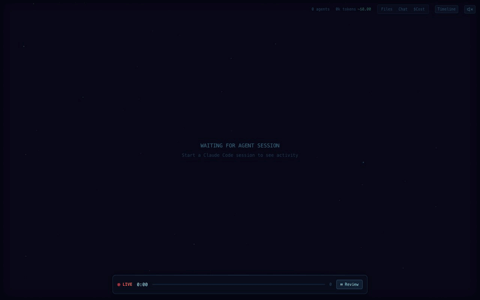

# Agent Flow adapter for the OpenAI Agents SDK

Streams [OpenAI Agents SDK](https://github.com/openai/openai-agents-python) runs into the Agent Flow visualizer. It's a trace processor that writes Agent Flow's JSONL event format, and Agent Flow replays that file and keeps following it as new events arrive.



It covers agents with function tools, handoffs, agents used as tools (`agent.as_tool()`), parallel tool calls, parallel runs inside one `trace()`, input and output guardrails, and `Runner.run`, `run_sync` and `run_streamed` alike.

## Install

```bash
pip install -e adapters/openai-agents
```

It needs Python 3.9 or later and `openai-agents` 0.2 or later.

## Use

```python
from agent_flow_openai_agents import install

install("/tmp/agent-flow.jsonl", truncate=True)
result = await Runner.run(triage_agent, "My dashboards are timing out")
```

Then open it in Agent Flow:

- **Standalone (no VS Code):** `npx agent-flow-app --event-log /tmp/agent-flow.jsonl`. From a clone of this repo, run `AGENT_FLOW_EVENT_LOG=/tmp/agent-flow.jsonl pnpm run dev`
- **VS Code:** set `agentVisualizer.eventLogPath` to `/tmp/agent-flow.jsonl`

`install()` adds the processor next to the SDK's own, so your traces still reach the OpenAI dashboard. Pass `exclusive=True` to replace the SDK's processors instead, which also stops uploads (handy offline, in tests or without a key). You don't attach anything to your agents; every run in the process is traced.

Don't turn tracing off. `set_tracing_disabled(True)`, `OPENAI_AGENTS_DISABLE_TRACING=1` and `RunConfig(tracing_disabled=True)` all disable this processor too. Tool arguments, tool results and model text come from traced data, so they also need `trace_include_sensitive_data`, which is on by default.

To try it without an API key:

```bash
python adapters/openai-agents/examples/support_desk_demo.py --out /tmp/agent-flow.jsonl
```

The demo is a support desk with 7 agents, nested four levels deep:

- **Parallel runs:** a triage run and a sentiment run start together inside one `trace()`.
- **Handoffs:** Triage hands off to Tech Support, which hands off to Billing. Triage also declares Billing and Sales, so those routes are drawn but not taken.
- **Parallel tool calls:** Tech Support makes three tool calls in one turn. One of them, a status check, fails and is retried. Another runs a log analyst agent (`as_tool()`), which runs a DB inspector agent in turn.
- **Guardrails:** an input guardrail runs on Triage and an output guardrail on Billing.

`examples/fake_model.py` is a stateless rule-based `Model` that emits generation spans with model names and token usage.

## How the Agents SDK maps to Agent Flow

| Agents SDK | Agent Flow |
|---|---|
| Trace (a `Runner.run`, or everything in `with trace(...)`) | Main agent, named after the trace. Its graph is the run's routing: agents are nodes, handoffs are hops, and each agent's declared handoffs are dashed routes. Parallel runs branch out from START. |
| Agent span | Subagent of the trace |
| Agent run from another agent's tool (`as_tool()` or your own) | Subagent of that agent. Concurrent runs of one agent get `name #2`, … |
| Function span | `tool_call_start` / `tool_call_end`, with `isError` when the tool raises |
| Handoff span | A `handoff → <agent>` tool call on the source agent |
| Guardrail span | A `guardrail: <name>` check that fails when its tripwire triggers |
| Generation / response span | `message` (text, plus `thinking` for reasoning), `model_detected`, and `context_update` from token usage |

The SDK calls trace processors synchronously, in the task that opens or closes each span, and every span carries its parent. So events are written in order, with no buffering. Two details:

- **Tool arguments:** the SDK fills them in just after opening a function span, so the tool call is reported on the next turn of the event loop.
- **Agent handoffs and tools:** these are only complete when an agent's span ends, so each agent's declared routes are added to the graph then.

## Tests

```bash
pip install -e 'adapters/openai-agents[dev]'
pytest adapters/openai-agents/tests
```
