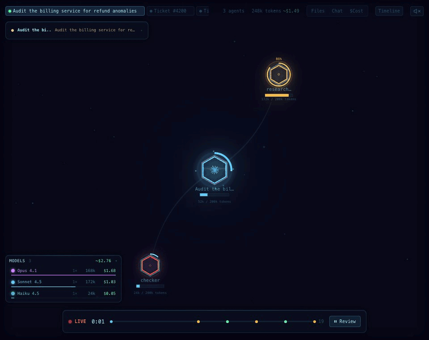
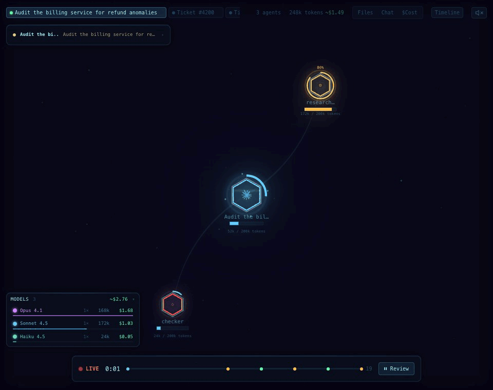
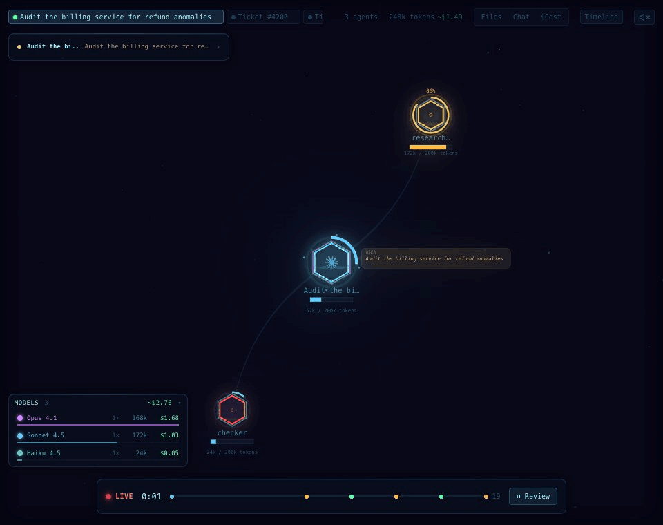
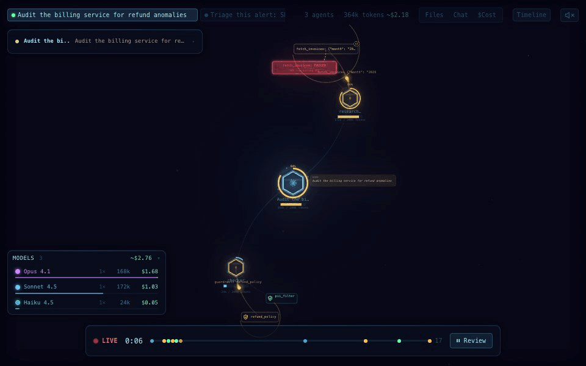
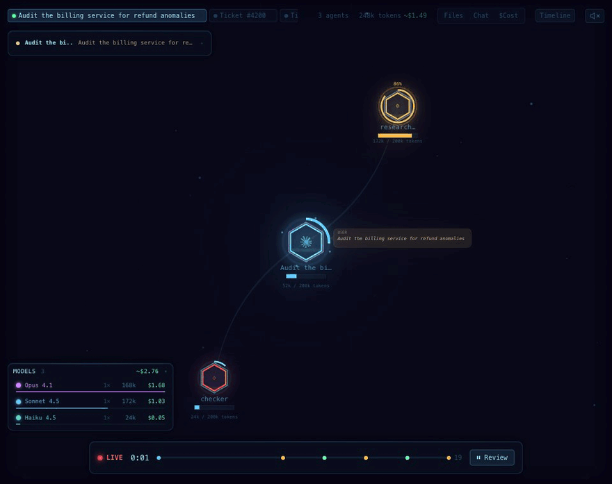

# Agent Flow user guide

Agent Flow draws agent runs as they happen. You see agents spawning sub-agents, tool calls, messages, routing graphs, timings and costs, and you can then dig into a run: find what made it slow, compare it with others, and share it.

This guide covers:

1. [Running Agent Flow](#1-running-agent-flow)
2. [Getting runs in](#2-getting-runs-in): Claude Code and Codex, the framework adapters, HTTP, and **OpenTelemetry**
3. [Hooking up OpenTelemetry](#3-hooking-up-opentelemetry), step by step, per framework
4. [Finding your way around](#4-finding-your-way-around)
5. [The execution timeline](#5-the-execution-timeline): critical path and scrubbing
6. [The Graph panel](#6-the-graph-panel): overlays, all runs, and comparing runs
7. [Reading the canvas](#7-reading-the-canvas): context, failures, models, large runs
8. [Sharing a run](#8-sharing-a-run)
9. [Running it for a team](#9-running-it-for-a-team)
10. [Troubleshooting](#10-troubleshooting)
11. [Reference](#11-reference)

---

## 1. Running Agent Flow

The features in this guide are built from source. The published `npx agent-flow-app` package doesn't have them yet.

```bash
git clone https://github.com/ashwyn-code/agent-flow.git
cd agent-flow
pnpm i
pnpm build:app
node app/dist/app.js
```

This starts the app on <http://127.0.0.1:3001> and opens your browser. Everything runs on your machine, and the UI only listens on `127.0.0.1`.

Useful flags (full list in the [reference](#app-flags)):

| Flag | What it does |
|---|---|
| `--port 3002` | Use another port |
| `--no-open` | Don't open a browser |
| `--event-log run.jsonl` | Also show an Agent Flow event log (repeatable) |
| `--otel-file traces.jsonl` | Also show an OpenTelemetry trace file (repeatable) |
| `--ingest-token <token>` | Require this token for events sent over HTTP |
| `--ingest-host 0.0.0.0 --ingest-port 3101` | Accept events from other machines (needs a token) |

For development with hot reload, run `pnpm run dev` and open <http://localhost:3000>. There's also a VS Code extension (**Agent Flow: Open Agent Flow**) that shows the same UI in an editor tab.

---

## 2. Getting runs in

Agent Flow takes runs from five kinds of source. Each run becomes a **session**, shown as a tab in the top bar.

| Source | Use it when | How |
|---|---|---|
| **Claude Code / Codex** | You use those agents | Automatic: sessions are picked up from `~/.claude` and `~/.codex` |
| **Framework adapters** | You build agents with LangGraph, Strands, Agent Framework, CrewAI, OpenAI Agents SDK or Google ADK and can add a line of code | Add the adapter; it writes a JSONL log or sends over HTTP (see [adapters](#framework-adapters)) |
| **OpenTelemetry, live** | Your agents already emit OTel traces, or you run a Collector | Point an OTLP exporter at `/v1/traces` ([section 3](#3-hooking-up-opentelemetry)) |
| **OpenTelemetry, file** | You have exported traces (a Collector file exporter, a backend export) | `--otel-file traces.jsonl` |
| **Event log file** | Anything that writes Agent Flow's [JSONL event format](../README.md#jsonl-event-format) | `--event-log run.jsonl` |

**Adapters or OpenTelemetry?** The adapters see more, such as LangGraph's declared conditional edges or CrewAI's delegation. OpenTelemetry needs no new code if you already trace. Adapters suit development and staging; OpenTelemetry suits traffic you already collect.

### Framework adapters

Each adapter lives in `adapters/<framework>/`, and its README shows the one line that attaches it. By default an adapter writes a JSONL file:

```bash
node app/dist/app.js --event-log agent-flow-events.jsonl
```

To send over HTTP instead, which works across processes, containers and machines, set these in the agent's environment:

```bash
export AGENT_FLOW_URL=http://127.0.0.1:3001/ingest
export AGENT_FLOW_TOKEN=...          # only if the app was started with --ingest-token
```

Adapters never slow down or crash your agents. They deliver from a background thread, and if Agent Flow is down, events are dropped and counted.

---

## 3. Hooking up OpenTelemetry

Agent Flow is an **OTLP/HTTP trace receiver**. Any OpenTelemetry SDK or Collector can send it traces:

| | |
|---|---|
| Endpoint | `http://<host>:<port>/v1/traces` (default `http://127.0.0.1:3001/v1/traces`) |
| Protocols | `http/protobuf` (the SDKs' default) and `http/json`, plain or gzip |
| **Not supported** | OTLP over **gRPC** (port 4317). Use HTTP. |
| Auth | Loopback clients need nothing. Other machines need `--ingest-token` and send `Authorization: Bearer <token>` |

### Step 1: start Agent Flow

On the same machine as your agents:

```bash
node app/dist/app.js
```

To accept traces from other machines or containers:

```bash
node app/dist/app.js --ingest-host 0.0.0.0 --ingest-port 3101 --ingest-token "$AGENT_FLOW_TOKEN"
```

The second listener serves only `/ingest` and `/v1/traces`; the UI stays on `127.0.0.1`. It refuses to start on a non-local address without a token.

### Step 2: point your exporter at it

**With environment variables** (works with any OTel SDK that reads the standard variables):

```bash
export OTEL_EXPORTER_OTLP_TRACES_PROTOCOL=http/protobuf
export OTEL_EXPORTER_OTLP_TRACES_ENDPOINT=http://127.0.0.1:3001/v1/traces
# Only for a token-protected listener (Python URL-decodes the value):
export OTEL_EXPORTER_OTLP_TRACES_HEADERS="Authorization=Bearer%20$AGENT_FLOW_TOKEN"
```

**In Python code:**

```python
# pip install opentelemetry-sdk opentelemetry-exporter-otlp-proto-http
from opentelemetry import trace
from opentelemetry.sdk.resources import Resource
from opentelemetry.sdk.trace import TracerProvider
from opentelemetry.sdk.trace.export import BatchSpanProcessor
from opentelemetry.exporter.otlp.proto.http.trace_exporter import OTLPSpanExporter

provider = TracerProvider(resource=Resource.create({"service.name": "support-agents"}))
provider.add_span_processor(BatchSpanProcessor(OTLPSpanExporter(
    endpoint="http://127.0.0.1:3001/v1/traces",
    # headers={"Authorization": "Bearer ..."},   # for a token-protected listener
)))
trace.set_tracer_provider(provider)
```

Call `provider.shutdown()` (or `provider.force_flush()`) before a short script exits, so the last spans are sent.

**In Node.js**, use `@opentelemetry/exporter-trace-otlp-proto` (or `-http` for JSON) with `url: 'http://127.0.0.1:3001/v1/traces'`.

### Step 3: turn on your framework's tracing

Agent Flow reads two span vocabularies: the OpenTelemetry **GenAI semantic conventions** (`gen_ai.*`) and **OpenInference** (`openinference.span.kind`). Here's how to get each framework to emit them, after setting up a tracer provider as in step 2:

| Framework | How to turn it on | Tested |
|---|---|---|
| **Strands Agents** | Built in. Strands uses the global tracer provider. Or let Strands set one up: `StrandsTelemetry().setup_otlp_exporter(endpoint="http://127.0.0.1:3001/v1/traces")` | ✓ |
| **Microsoft Agent Framework** | `from agent_framework.observability import enable_instrumentation` then `enable_instrumentation(enable_sensitive_data=True)`, with your tracer provider set as above. (`configure_otel_providers(otlp_endpoint=..., otlp_protocol="http")` is its all-in-one alternative.) | ✓ (with your own provider) |
| **Google ADK** | Built in. ADK uses the global tracer provider | ✓ |
| **OpenAI Agents SDK** | `pip install openinference-instrumentation-openai-agents`, then `OpenAIAgentsInstrumentor().instrument(tracer_provider=provider)` | ✓ |
| **LangGraph / LangChain** | `pip install openinference-instrumentation-langchain`, then `LangChainInstrumentor().instrument(tracer_provider=provider)` | ✓ |
| **CrewAI** | `pip install openinference-instrumentation-crewai`, then `CrewAIInstrumentor().instrument(tracer_provider=provider)` | not yet |

**Content.** Prompts and outputs appear only if the framework records them. Agent Framework needs `enable_sensitive_data=True`. Some GenAI instrumentations need `OTEL_INSTRUMENTATION_GENAI_CAPTURE_MESSAGE_CONTENT=true`. Without content, you still get the full shape: agents, tools, timing, tokens and errors.

### Step 4: run your agents and watch

A trace is shown **once its root span has arrived**. Spans are exported when they finish, and the root finishes last. Agent Flow then replays the trace in its own session tab at the pace it ran, with long pauses shortened to 2 seconds. If the root never arrives, which happens when it belongs to an upstream service that doesn't export here, the trace is shown after 15 seconds without new spans.

What you get:

- Agents become agents on the canvas. Nested agents and agents called as tools become sub-agents.
- Model calls add the model, thinking, replies and token counts.
- Tool calls show arguments, results and errors (including exception events, and ADK's `{"status": "error"}` results).
- **Graphs:** a span that runs other agents without calling a model itself is drawn in the Graph panel. That covers Strands graphs and swarms, Agent Framework workflows, ADK sequential, parallel and loop agents, LangGraph graphs, and chains of OpenAI handoffs. Edges are taken from the order things actually ran. Agent Framework also records its declared workflow, so branches that weren't taken, and their conditions, are drawn too.

### Using a Collector (recommended for production)

If you already run an OpenTelemetry Collector, send Agent Flow a copy of the traces alongside your observability backend. Your agents need no changes:

```yaml
receivers:
  otlp:
    protocols:
      grpc:
      http:

exporters:
  otlphttp/backend:            # your existing backend
    endpoint: https://otel.example.com
  otlphttp/agentflow:
    traces_endpoint: http://agent-flow.internal:3101/v1/traces
    headers:
      Authorization: "Bearer ${env:AGENT_FLOW_TOKEN}"

service:
  pipelines:
    traces:
      receivers: [otlp]
      exporters: [otlphttp/backend, otlphttp/agentflow]
```

Your agents can keep using gRPC to reach the Collector; only the Collector → Agent Flow leg is HTTP. To send Agent Flow only agent traces, add a `filter` processor to that pipeline.

### From a file

To keep a batch of traces and look at them later, or to use an export from a backend:

```yaml
exporters:
  file/agentflow:
    path: /var/log/otel/agent-traces.jsonl
```

```bash
node app/dist/app.js --otel-file /var/log/otel/agent-traces.jsonl
```

The file is followed as it grows. It can be one OTLP JSON document or JSON Lines of them. To convert traces into Agent Flow event logs instead:

```bash
pnpm otel:import traces.jsonl                 # list the traces
pnpm otel:import traces.jsonl --out runs/     # one JSONL file per trace
```

Loading many traces at once is also how you get the [All runs](#all-runs) view over a batch of production runs.

---

## 4. Finding your way around

- **Session tabs** (top-left): one per run. New sessions appear as they start.
- **Canvas:** drag to pan, scroll to zoom, click an agent or tool call for details, right-click for the menus. `Shift+F` zooms to fit.
- **Top bar:** agent count, tokens and estimated cost, and the panels (Files, Chat, $Cost, Graph, Timeline).
- **Control bar** (bottom): play/pause, speed (`1`–`4`), the event scrubber, **Review** (pause and look back) and **LIVE** (return to now).
- **Message feed** (top-left): the latest message from each agent.
- **Models legend** (bottom-left) and **minimap** (bottom-right) appear when they have something to show.

| Key | Action | Key | Action |
|---|---|---|---|
| `Space` | Play / pause | `T` | Timeline |
| `N` | Graph panel | `C` | Transcript |
| `f` | File attention | `$` | Cost overlay |
| `S` | Stats | `G` | Hex grid |
| `M` | Mute | `Shift+F` | Zoom to fit |
| `1`–`4` | Speed 0.5×–4× | `Esc` | Clear selection |

---

## 5. The execution timeline

Press **Timeline** (or `T`).



**Lanes.** There's one lane per agent, indented under the agent that started it. Each tool call is a bar; parallel calls stack on their own rows, and failed ones are red. Hover a bar for its duration, model, tokens or error. Click one to select that agent on the canvas.

**Critical path** (the button in the header, on by default). This highlights the chain of work that set the run's total duration. Starting from the end of the main agent, it steps back through whichever tool call or sub-agent finished last. It follows into sub-agents, including agents called as tools, and counts the gaps as the agent's own time (model calls, thinking, waiting). Work not on the path is dimmed, because speeding it up wouldn't make the run finish sooner.

- The header shows how the path's time splits between tools and agents.
- The footer lists the largest items on the path: start there when a run is slow.

**Scrubbing.** Drag the ruler at the top of the timeline, or the ▼ playhead, to move through the run:

- The canvas, Graph panel and overlays replay to that moment.
- The part of the timeline after the playhead is dimmed.
- The **"At 5.4s"** strip below lists each agent running at that moment: its model, how full its context was (split by source when the runtime reports it, as Claude Code does), and what it was doing (a tool in progress, or its latest thought or message). Click a row to select the agent.

Scrubbing pauses the live view. Press **▶ LIVE** in the control bar to return to now.

---

## 6. The Graph panel

Press **Graph** (or `N`). It's available when a run has a graph shape: from adapters, or from OpenTelemetry workflows.

### Reading the graph

- **Layout:** nodes run top to bottom from START to END. Parallel branches sit side by side, and loops are drawn as arcs.
- **Routes:** bright edges were taken and dim ones weren't. Dashed edges are conditional.
- **Counts:** `×N` on a node is how many times it ran, and `×N` on an edge is how many times that hop was taken.
- **Live state:** the running node pulses amber, the hop just taken animates, and failed nodes are red.
- **Subgraphs** (`▸`): click to open the nested graph. The breadcrumb takes you back up.

### Overlays



The **Runs / Time / Tokens / Cost / Errors** switch colors each node by how much of that it accounts for, and labels it with the value. The footer names the top node. Time is summed over a node's runs. Tokens, cost and errors include the sub-agents the node ran. Cost uses the same per-model estimate as the `$Cost` view.

### All runs



Once the same graph has run more than once, a **This run / All runs / Compare** switch appears. **All runs** folds every run the page has seen into one graph. Each session is a run, and so is each parallel instance of a subgraph (`research_team #2`).

- **Edges** show the share of runs that took them (`65%`). Routes no run took stay dim.
- **Overlays** become per-run figures: share of runs visited, median/p95 time (`1.2s/4.7s`), median tokens, cost per run, and the share of runs with errors. Hover a node to see all of them.

Use it to answer "how often do we take this route?", "which step is slow on its bad days?" and "where do failures cluster?".

### Compare

**Compare** diffs the selected run against another run of the same graph. By default that's the most recent other run; pick any from the **vs** list.

- **Green, marked `new`:** routes and nodes only this run took.
- **Red, dashed, marked `gone`:** routes and nodes only the baseline took.
- **Overlays:** each node's change in time, tokens, cost or errors, where red is worse and green is better.
- **Footer:** duration, estimated cost, tokens, tool calls, errors and agents for both runs, with the change in each.

Use it after a prompt, model or code change: run the workflow again and compare it with the run before.

---

## 7. Reading the canvas



- **Context gauge.** A ring around each agent fills as its context window does. It stays blue, turns amber above 80% and red above 90%, and shows the percentage past 70%. When context shrinks by 30% or more (compaction or truncation), the ring collapses inward with a `context 168k → 52k` label.
- **Failures.** A failed tool call sends red ripples out from its card and its agent.
- **Retries.** A call to the same tool that follows a failure is drawn with a dashed arc from the failed card, labelled `retry N`, and the card carries a `↻N` badge.
- **Guardrails.** Tool calls named `guardrail: …` get a shield: a check when they pass, a cross and `TRIPPED` when they trip.
- **Models.** Each agent's outer ring is tinted by its model: Opus purple, Sonnet blue, Haiku teal, GPT green (lime for mini), Gemini amber. Other models get a stable color of their own.
- **Models legend** (bottom-left). It lists the models in use, with agent count, tokens and estimated cost, for the whole run (finished agents included). Hover a model to dim every other agent. Click the header to fold it away.

### Large runs



- **Collapse subtree:** right-click an agent that has sub-agents. Everything under it folds into a stacked hex with a `+N` badge. The badge pulses amber while something hidden is still working and turns red if something hidden failed. Right-click again to **Expand subtree**.
- **Collapse all subtrees / Expand all:** in the canvas right-click menu. Collapse all leaves the main agent and its direct children. Selecting a hidden agent from the timeline, Graph panel or feed unfolds its way back.
- **Minimap** (bottom-right): appears once there are 6 or more agents on screen, or when something is off screen. It shows every agent (collapsed ones ringed) and the part in view. Click or drag it to move there. **Minimap: auto / on / off** in the canvas menu changes when it shows.

---

## 8. Sharing a run

Right-click the canvas:

- **Export replay (HTML)** downloads the session as one self-contained HTML file. It needs nothing else: no Agent Flow, no install, no network. Opening it replays the run at its original pace. Afterwards the timeline, Graph panel, overlays and scrubbing all work, and **replay again** starts it over. You can attach it to a pull request or an incident write-up.
- **Export events (JSONL)** saves the raw events in Agent Flow's event format.

Without the UI, for example as a CI artifact:

```bash
pnpm build:app                                   # once
pnpm replay:export run.jsonl -o run.html
pnpm replay:export traces.jsonl --trace 4bf9 -o incident.html    # from OpenTelemetry
```

> A replay contains everything the session showed, including prompts, tool arguments and results. Check it before you share it, or record runs with redaction on (next section).

---

## 9. Running it for a team

- **Access.** The UI has no login and listens on `127.0.0.1` only. Share it through your own authenticating proxy, or give people replay files. Event and trace endpoints on other interfaces require `--ingest-token`.
- **Redaction.** Adapters can keep a run's shape and drop its content: `content="metadata"` (or `AGENT_FLOW_CONTENT=metadata`) replaces prompts, arguments, results and messages with their length. A `redact=` function can rewrite or drop any event. For OpenTelemetry, redact in the Collector with an `attributes` or `transform` processor.
- **Sampling.** `sample_rate=0.05` (or `AGENT_FLOW_SAMPLE_RATE`) records that fraction of runs; each decision covers a whole run. For OpenTelemetry, use the Collector's `probabilistic_sampler` or tail sampling.
- **Storage.** Agent Flow keeps sessions in memory for the live view. It isn't a trace store, so keep your observability backend as the system of record. Use `--otel-file` (or replay files) to come back to a batch of runs.

---

## 10. Troubleshooting

| Symptom | Likely cause and fix |
|---|---|
| No OpenTelemetry sessions appear | The exporter is using gRPC (4317) or the wrong path. Use `http/protobuf` to `…/v1/traces`. |
| Traces appear only after the run ends | Expected: a trace is shown once its root span arrives. Long runs appear when they finish. |
| A trace appears 15 s late, with an extra top-level agent | Its root span is in another service that doesn't export here. Export that service too, or accept the delay. |
| `401` from `/v1/traces` or `/ingest` | The app was started with a token: send `Authorization: Bearer <token>`. In `OTEL_EXPORTER_OTLP_HEADERS`, write the space as `%20`. |
| `403` from another machine | No token is configured, so only loopback clients are allowed. Start with `--ingest-token`. |
| Agents and tools but no prompts or replies | Content capture is off in the instrumentation (see the content note in [step 3](#step-3-turn-on-your-frameworks-tracing)). |
| The Graph button is missing | The run has no graph shape: a single agent with tools doesn't make a graph. |
| All runs / Compare are missing | They need at least two runs of the same graph seen since the page loaded. Reloading starts from zero. Load a trace file with `--otel-file` for a batch. |
| `wrap_function_wrapper() got an unexpected keyword argument` (OpenInference on Python 3.9) | Install `wrapt<2`. |
| Last spans of a short script never arrive | Call `provider.shutdown()` before exiting. |
| Export replay says it can't export here | It needs the single-bundle build (the standalone app, or an exported replay). From `pnpm run dev`, use **Export events (JSONL)** and `pnpm replay:export`. |

---

## 11. Reference

### App flags

| Flag | Description |
|---|---|
| `-p, --port <n>` | Port for the UI and endpoints (default 3001) |
| `-e, --event-log <path>` | Also show an Agent Flow JSONL event log (repeatable) |
| `--otel-file <path>` | Also show an OTLP JSON trace file, followed as it grows (repeatable) |
| `--ingest-token <token>` | Require this bearer token on `/ingest` and `/v1/traces` |
| `--ingest-host <host>`, `--ingest-port <port>` | A second listener that serves only `/ingest` and `/v1/traces` (a non-local host requires a token) |
| `--no-open` | Don't open the browser |
| `-v, --verbose` | Detailed logs |

### Endpoints

| Path | Accepts |
|---|---|
| `GET /events` | Server-sent events for the UI |
| `POST /ingest` | Agent Flow events from the adapters' HTTP transport: `{ "session": { "id", "label" }, "events": [...] }` |
| `POST /v1/traces` | OpenTelemetry traces (OTLP/HTTP, protobuf or JSON, optionally gzip) |

### Environment variables

| Variable | Used by | Description |
|---|---|---|
| `AGENT_FLOW_EVENT_LOG` | app, adapters | Event logs to follow; the adapters' default output file |
| `AGENT_FLOW_OTEL_FILE` | app | OTLP trace files to follow |
| `AGENT_FLOW_INGEST_TOKEN` | app | Same as `--ingest-token` |
| `AGENT_FLOW_RUNTIME` | app | `claude` or `codex` to watch only one |
| `AGENT_FLOW_URL`, `AGENT_FLOW_TOKEN` | adapters | Send to `/ingest` instead of a file |
| `AGENT_FLOW_CONTENT=metadata` | adapters | Drop content, keep shape |
| `AGENT_FLOW_SAMPLE_RATE` | adapters | Fraction of runs to record |
| `OTEL_EXPORTER_OTLP_TRACES_ENDPOINT`, `…_PROTOCOL`, `…_HEADERS` | your OTel SDK | Where to send traces |

### Command-line tools

| Command | Description |
|---|---|
| `pnpm otel:import <file> [--out dir \| --trace id]` | Convert OTLP JSON traces to Agent Flow JSONL |
| `pnpm replay:export <file> [-o out.html] [--trace id] [--label text]` | Build a self-contained HTML replay (after `pnpm build:app`) |

For the event format, the adapters' options and development, see the [README](../README.md).
